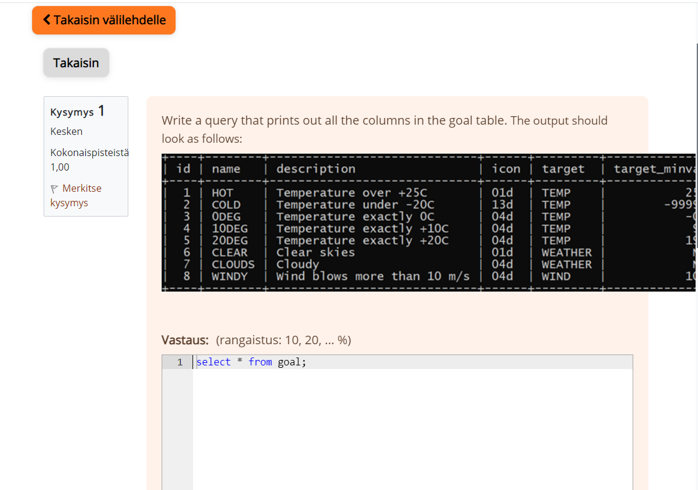
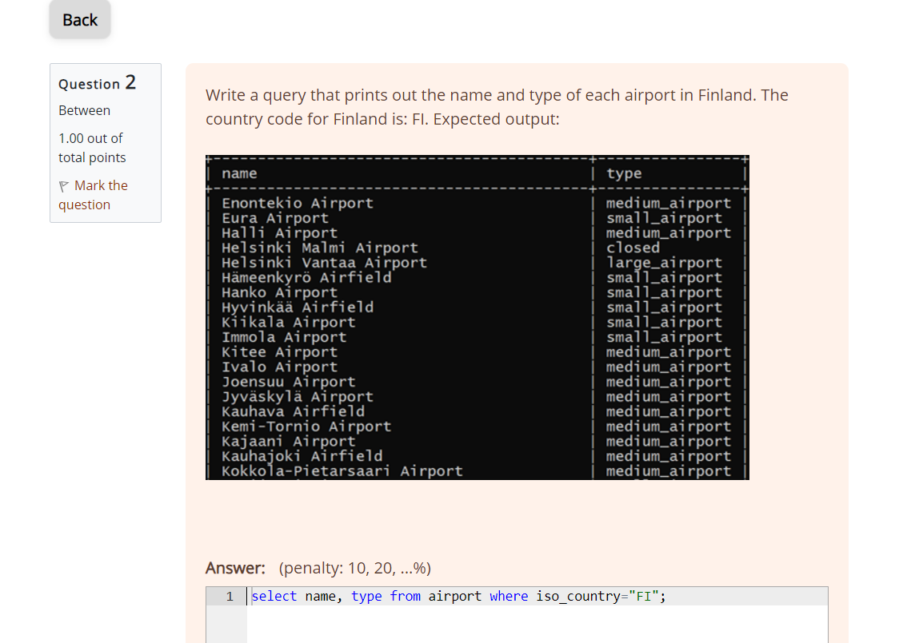
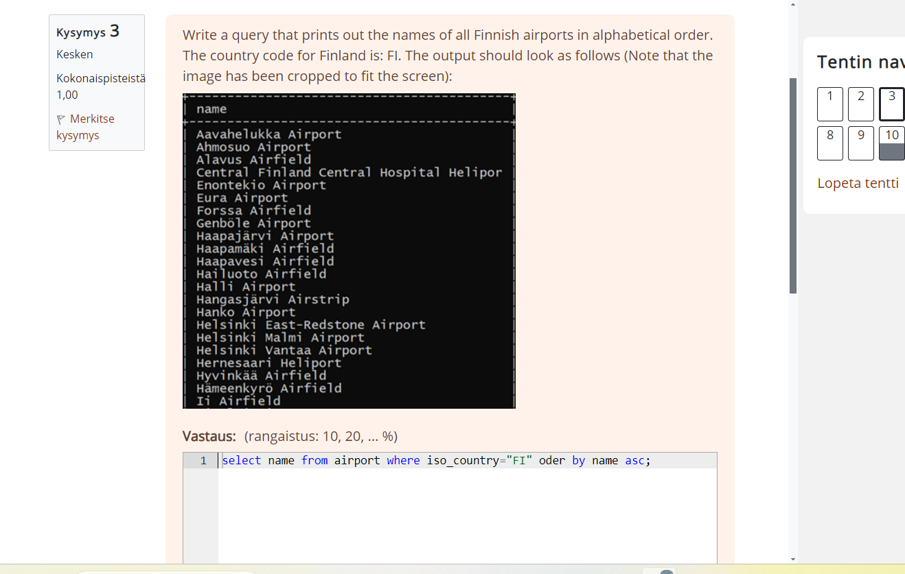
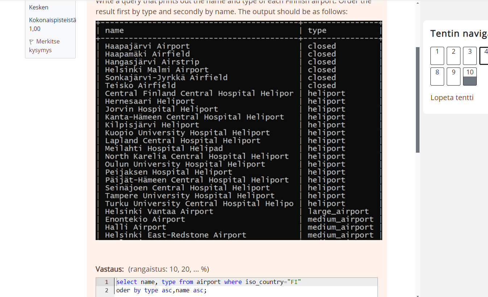
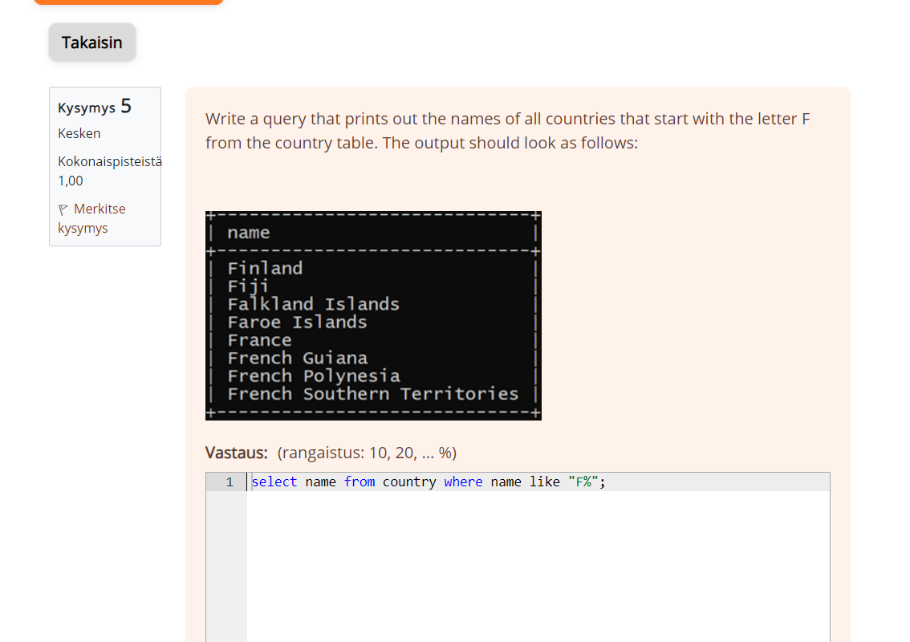
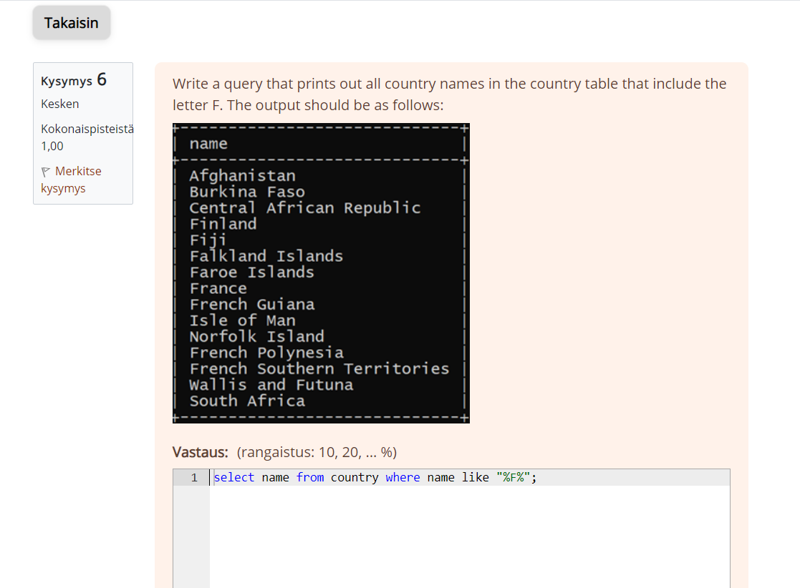
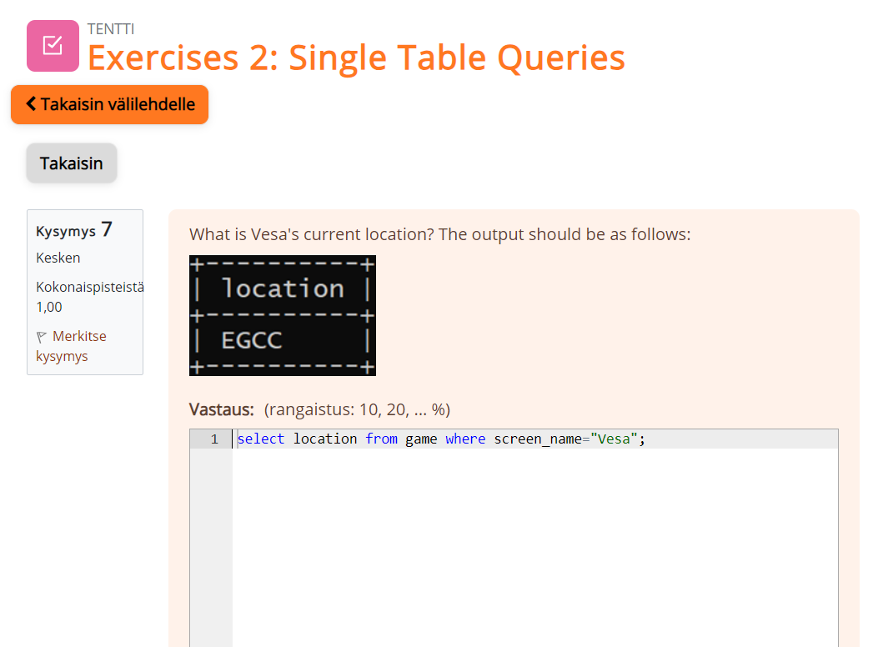
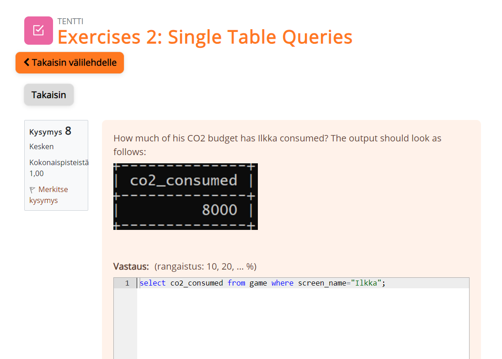
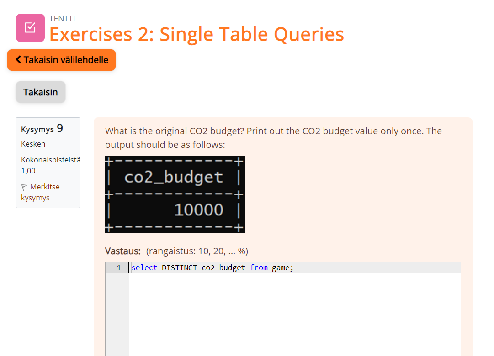
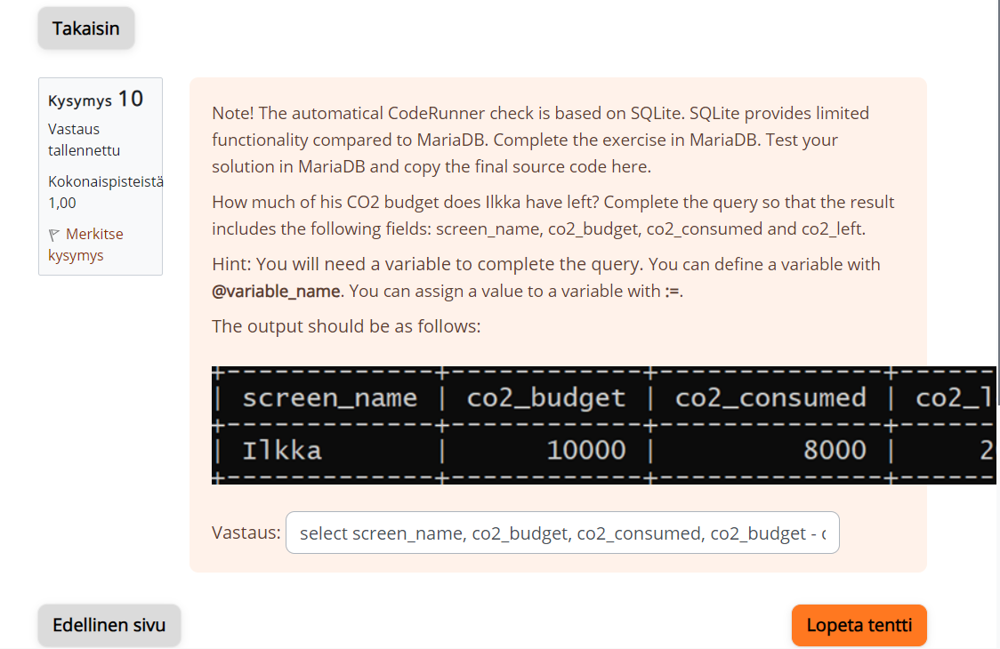

#Week3

Nape Vithanage Chanika Anjalee

###Assignment 1 

select * from goal;

###Assignment 2

select name, type from airport where iso_country="FI";

###Assignment 3

select name from airport where iso_country="FI" oder by name asc;

###Assignment 4

select name, type from airport where iso_country="FI" oder by type asc,name asc;

###Assignment 5

select name from country where name like "F%";

###Assignmet 6

select name from country where name like "%F%";

###Assignmet 7

select location from game where screen_name="Vesa";

###Assignment 8

select co2_consumed from game where screen_name="Ilkka";

###Assignment 9

select DISTINCT co2_budget from game;

###Assignment 10

select screen_name, co2_budget, co2_consumed, co2_budget - co2_consumed as co2_left from game where screen_name="Ilkka";
